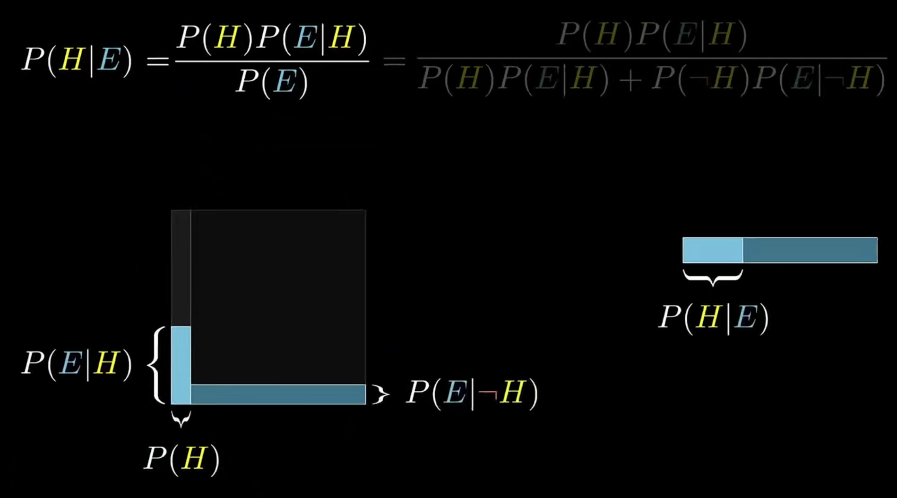
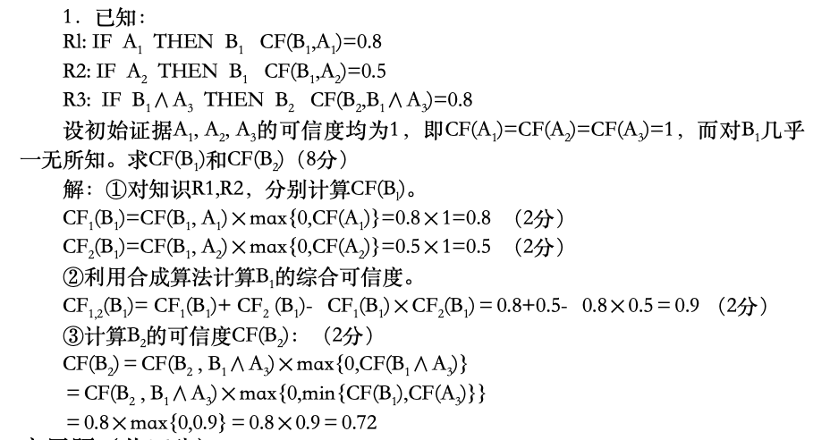
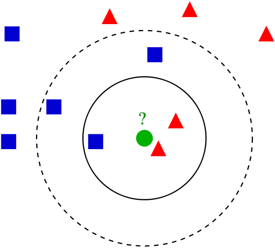

# 人工智能复习笔记

> 本笔记内出现内容皆为考试重点。本笔记参考教材为《人工智能 原理、算法和实践》第二版，由尚文倩编著，清华大学出版社出版。是一本很垃圾的教材，我们找三五个同学花一个月时间也可以写出一本，内含垃圾代码、头重脚轻、混淆概念、概念不写明原文和来源、非主流主题等问题，不建议各位老师和同学选择。

> 除上面这段引用外，本文仅大可能抑制住了对本书的不满与吐槽。

## 第一章 绪论

### 人工智能概念提出（时间，地点）

   1956年，美国 `Dartmouth` （达特茅斯）学院

### 人工智能三大学派

- 符号主义

   基于物理符号系统假设和有限合理性原理。
  - 物理符号系统假设

       假设认为物理符号系统具有必要且足够的方法实现普通的智能行为，可用计算机符号操作模拟人的认知过程，以此来模拟人类智能行为。

  - 有限合理性原理

       用启发式搜索的试探性方法求得问题的有限合理解
- 连接主义

   基于神经元级神经元之间的网络联结机制模拟和实现人工智能
- 行为主义

   基于控制论和“感知-动作”控制系统

### 应用领域

- 问题求解（**最早的研究领域**）
- 专家系统
- 机器学习
- 数据挖掘
- 机器视觉

## 第二章 知识表示

> 知识表示：知识的符号化和形式化的过程

### 谓词逻辑表示法 **（大题）**

**谓词就是命题的一种符号化形式**。命题是一句可以判断正误的陈述句（比如：老张是一名教师，谓词就是 `Teacher(LaoZhang)`），谓词 `P(x1,x2...)` 表示的含义就是 `x1` 是/属于 `p`。谓词 = 谓词名 `P`+ 个体 `x1/x2` (个体是一个常量/变量/函数整体)。

谓词逻辑表示法做题流程：

1. 定义谓词
2. 用**连接词**和**量词**连接各个谓词，形成**谓词公式**。

#### 例题

例：设有下列语句，请用相应的谓词公式把他们表示出来：

(1) 有的人喜欢打羽毛球，有的人喜欢打网球，有的人既喜欢打羽毛球又喜欢打网球。

答：

定义谓词：

P(x) 表示 x 是人；

L(x,y) 表示 x 喜欢 y。其中 y 的个体域是 {羽毛球，网球}

谓词公式表示为：(∃x)(P(x)→L(x, 羽毛球)∨L(x, 网球)∨(L(x,网球)∧L(x, 羽毛球)))

(2) 他每天下午都去打网球。

答：

定义谓词：

HE(x) 表示 x 是他；

T(x) 表示 x 打网球；

AN(x) 表示 x 是下午；

(∀x)(∀y)(HE(x)∧AN(y)→T(x))

还有一类题要求用谓词逻辑表示法描述状态及状态的转移，但是这类题老师改起来很难改，大概不会出。

### 产生式表示法

产生式表示法主要有事实和规则两种表示。

对于事实表示，采用四元组（对象，属性，值，可信度）或（关系，对象1，对象2，可信度），当表达确定性事实时，可以省略可信度。对于规则，表示事实间的因果关系，表现为 `P → Q` 或 `IF P THEN Q`。

### 框架表示法

非常类似 oop 编程时写的类，看个例子就懂了：

```text
Frame< COLLEGE TEACHER >
Name: Unit(Last name, First name)
Sex: Area(Man, Woman)
     Default: Man
Age: Unit(Years)
...
```

### 语义网络表示法 **（大题）**

语义网络可以表示语义联系和知识，其实类似产生式的事实和规则。对于语义联系需要理解以下专用词，除类属关系用三个简写外其他都是自然语言：

- 类属关系
  - ISA，IS-A 是一个
  - AKO，A-Kind-Of 是一种
  - AMO，A-Member-Of 是一个成员
- 包含关系
- 位置关系
- 时间关系

而知识分为事实性知识、情况和动作、逻辑关系。事实性知识就是用上面的语义联系描述事实。情况和动作比较特殊，对于描述情况时需要加一个情况节点；对于描述动作时要加一个事件节点或动作节点；描述逻辑关系更加复杂，需要定义子空间来实现全程变量。

这段说是要出大题，实际上一人一个答案，学起来很麻烦，改起来也很麻烦，花时间在上面收益并不高，考试时即兴发挥即可。

### 知识图谱表示

其实就是语义网络的技术实现，用到了 `xml`，应该是很老的技术了，笔试应该不考它。不过老师要求记住：

> Protégé软件是斯坦福大学医学院生物信息研究中心基于Java语言开发的本体编辑和知识获取软件

## 第三章 搜索策略  **（大题）**

1. 博弈树的**启发式策略**

2. **A*算法**实现最优路径规划

## 第四章 确定性推理

### 推理的逻辑基础

置换就是演绎推理，由一般推理出特殊，合一不知道。

正向推理就是从已知事实出发，正向使用规则

逆向推理就是以假设作为出发点

### 归结演绎推理**（大题）**


### 基于规则的演绎推理

- 规则**正向**演绎推理
- 规则**逆向**演绎推理
- **混合**

## 第五章 不确定性推理

### 前置知识补充

贝叶斯公式：

贝叶斯公式可以用来计算在得到新的证据 $E$ 后，更新假设 $H$ 的可能性（概率）。

$$P{ \left( { H \left| E\right. } \right) }=\frac{{P \left( {H} \left)  \cdot P{ \left( {E \left| {H}\right. } \right) }\right. \right. }}{P \left( {E} \right)}$$

$P{ \left( { H \left| E\right. } \right) }$ 指在证据 $E$ 下，假设 $H$ 成立的可能性，也叫后验概率。

$P \left( {H} \right)$ 指假设成立的概率，也叫先验概率。

$P{ \left( { E \left| H\right. } \right) }$ 指在假设 $H$ 成立时，得到证据 $E$ 的可能性。

$P \left( {E} \right)$ 指得到证据的概率等于假设成立时，得到证据的概率加上假设不成立时得到证据的概率。



### 主观贝叶斯方法

> 草，原来不考大题

- 作用

### 可信度方法**（大题）**

使用CF模型（Certainty Factor，可信度因子）解题，其中涉及一些基本方法和公式：

- 组合证据（例如 $E_1 \land E_2$）若证据间是与关系，取最小值，或关系取最大值。
  例如 $CF(E_1)=0.5$、$CF(E_1)=0.4$ 则 $CF(E_1 \land E_2)=0.4$、$CF(E_1 \lor E_2)=0.5$
- 组合针对同一假设的多个证据的可信度时，若同号且均正（或负），则用 和 减去（或加）乘积；若异号则和除以用1减去其中绝对值最小的绝对值。

#### 例题



## 第六章 机器学习

## 第七章 深度学习

> 论述题

1. KNN（K-Nearest Neighbors，K最邻近）
  
  在上述例子内，测试样本（绿色圆形）应归入要么是第一类的蓝色方形或是第二类的红色三角形。如果k=3（实线圆圈）它被分配给第二类，因为有2个三角形和只有1个正方形在内侧圆圈之内。如果k=5（虚线圆圈）它被分配到第一类（3个正方形与2个三角形在外侧圆圈之内）。
2. SVM（Support-Vector Machine，支持向量机），对于支持向量机来说，数据点被视为 $\displaystyle p$ 维向量，而我们想知道是否可以用 $\displaystyle (p-1)$ 维超平面（对于二维平面来说就是线）来分开这些点。

两种算法都是监督式学习算法，可用于回归和分类问题。

应用：

- 用于文本和超文本的分类。
- 用于图像分类。
- 用于手写字体识别。
- 用于医学中分类蛋白质。
