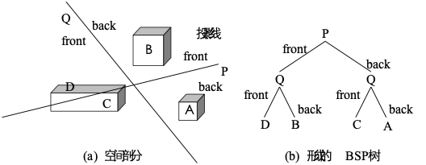

# 图形学作业题

## 第一题，（代码题）三角形的一个顶点绕x轴，y轴的缩放，并把这个缩放前后的点绘制在一个平面上

绘制一个三角形的关键代码：

```cpp
glClear(GL_COLOR_BUFFER_BIT);
glColor3f(1.0f, 1.0f, 1.0f);
glBegin(GL_LINE_LOOP);
glVertex2f(0.0f, 0.0f);
glVertex2f(0.0f, 9.0f);
glVertex2f(12.0f, 0.0f);
glEnd();
```

缩放的关键代码：

```cpp
glScalef(2.0f, 1.0f,1.0f);
```

## 第二题，已知三维基本几何变换中，某个旋转变换，例如：Trx，如何求得Try，Trz

见图：


## 第三题，写出相对应区间参考点的三维缩放变换，对应的变换规律

什么玩意，没见过这题，也听不懂再问啥。

三维缩放变换矩阵:

$$ T_s = \begin{bmatrix} a & 0 & 0 & 0 \\ 0 & e & 0 & 0 \\ 0 & 0 & j & 0 \\ 0 & 0 & 0 & 1 \end{bmatrix} $$

其中，$a$是x轴缩放系数，$e$是y轴缩放系数，$j$是z轴缩放系

## 第四题，空间几何体（三维模型），绕某一个顶点m点（参考点）的缩放矩阵写出来，再一次缩放平移的矩阵写出来

见图，最好把字母A换成小写s，注意左侧那个图像是不需要画的，最好不要画避免抄重了：


## 第五题，写出当透视投影变换在透视中心在Z的负轴上，距离XOY面的距离为d，且投影面为XOY面，把这样的一个透视的投影变换矩阵写出来

见图，图像同样不画


## 第六题，讨论当d趋近无穷大时，这个透视投影会变成啥投影

当d趋近于无穷大时，这个透视投影会变成正投影或斜投影。

## 第七题，简述计算机图形学的简单光照模型的原理

简单光照模型中，只考虑反射光的作用。反射光由环境光，漫反射光和镜面反射光三部分组成。从视点观察到物体上任一点P处的光强度I应为环境光反射光强度Ie、漫反射光强度Id以及镜面反射光的光强度Is的总和：

$$ I = I_e + I_d + I_s = I_aK_a + I_pK_d(L \cdot N) + I_pK_s(R \cdot V)^n$$

## 第八题，简述phong明暗原理

Phong明暗处理方法，又称为法矢量插值明暗处理，它对多边形顶点的法矢量进行插值以产生中间各点的法矢量，其步骤为：

- 计算每个多边形顶点处的平均单位法矢量；
- 用双线性插值方法求得多边形内部各点的法矢量;
- 最后按光照模型确定多边形内部各点的光强。

## 第九题，简述深度缓存器(Z-buffer算法) 的原理

基本原：

- 帧缓存：保存各点的颜色。
- Z缓存：保存屏幕坐标系上各象素点所对应的深度值。

算法步骤：

- 初始化：把Z缓存中各(x,y)单元置为z的最小值，而帧缓存各(x,y)单元置为背景色；
- 在把物体表面相应的多边形扫描转换成帧缓存中的信息时，对于多边形内的每一采样点(x,y)进行处理：
  - 计算采样点(x,y)的深度z(x,y)；
    - 计算方法：$ z(x,y) = -Ax-By-D/C$（假定多边形的平面方程为：$Ax+By+Cz+D=0$）
  - 如z(x,y)大于Z缓存中在(x,y)处的值，则把z(x,y)存入Z缓存中的(x,y)处，再把多边形在z(x,y)处的颜色值存入帧缓存的(x,y)地址中。

## 第十题，什么是走样？产生走样的原因？常见的走样现象有哪些？

1. 什么是：用离散量表示连续量引起的失真，就叫做走样（Aliasing）。
2. 产生原因：数学意义上的图形是由无线多个连续的、面积为零的点构成；但在光栅显示器上，用有限多个离散的，具有一定面积的象素来近似地表示他们。
3. 走样现象：一是光栅图形产生的阶梯形。一是图形中包含相对微小的物体时，这些物体在静态图形中容易被丢弃或忽略，在动画序列中时隐时现，产生闪烁。

## 第十一题，构造实体几何法优点及缺点及实现过程？

- 构造实体几何法（CSG，Constructive Solid Geometry）由两个实体间的并、交或差操作生成新的实体。

- 在构造实体几何法中，集合运算的实现过程可以用一棵二叉树（称为CSG树）来描述。

  - 树的叶子是基本体素或是几何变换参数；
  - 树的非终端结点是施加于其子结点的正则集合算子（正则并、正则交和正则差）或几何变换的定义。

- 优点：如果体素设置比较齐全，通过集合运算就可以构造出多种不同的符合需要的实体。
- 缺点一：集合运算的中间结果难以用简单的代数方程表示，求交困难。
- 缺点二：CSG树不能显式地表示形体的边界，因而无法直接显示CSG树表示的形体。

## 第十二题，多边形表面模型

边界表示(B-reps)的最普遍方式是多边形表面模型，它使用一组包围物体内部的平面多边形，也即平面多面体，来描述实体。

### 数据结构

- 几何信息
  - 建立3张表：顶点表、边表和多边形表来存储几何数据。
  - 实体模型中，用多边形顶点坐标值以及多边形所在平面方程方式保存实体单个表面部分的空间方向信息。
- 拓扑信息：翼边结构表示（Winged Edges Structure）

- 属性信息：用属性表来存储多边形面的属性，指明物体透明度及表面反射度的参数和纹理特征等等。

### 多边形网格

多边形网格：三维形体的边界通常用多边形网格（polygon mesh）的拼接来模拟。


## 扩展，还可能考的问题（Optional）

### BSP树


